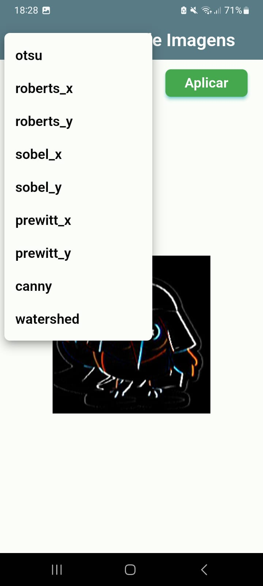
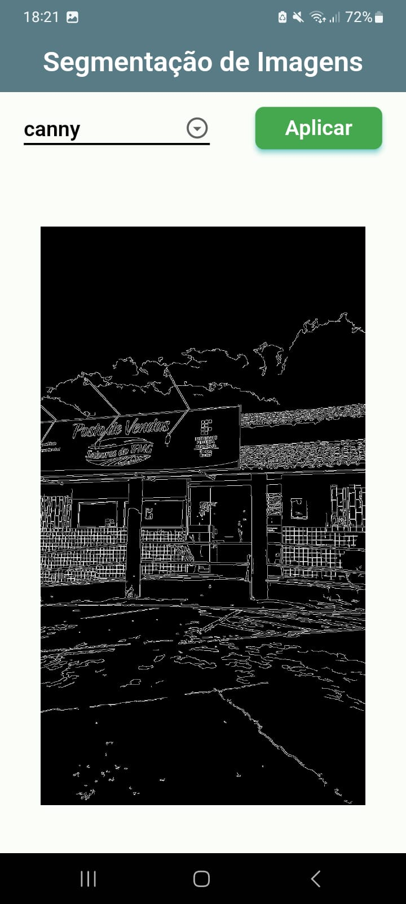
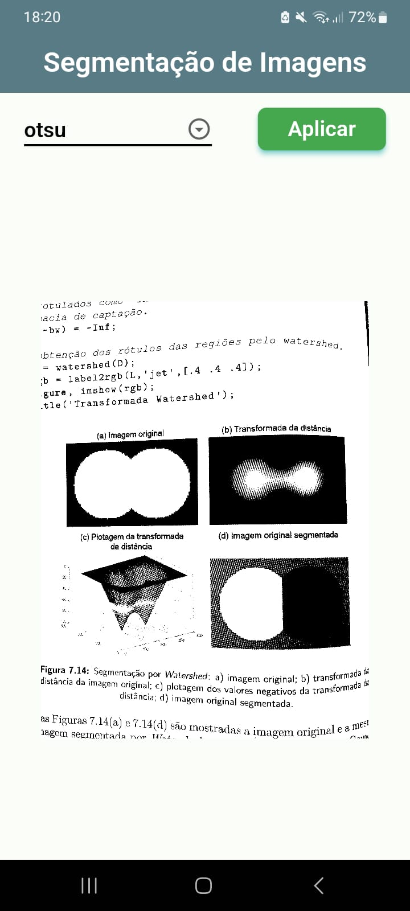
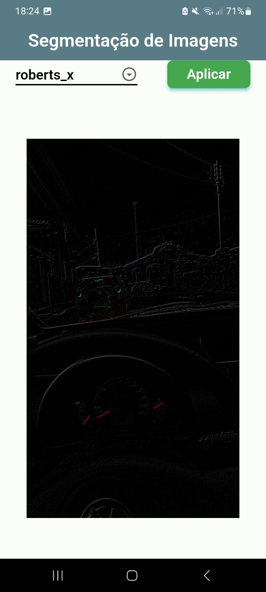

# Segmentação de Imagens

Este aplicativo foi desenvolvido para realizar alguns processos em imagens digitais, para a disciplina de Processamento Digital de Imagens. Gostei demais de fazer isso, pois primeiramente fiz os códigos em python e pensei, porquê não fazer uma API e chamar ela via app, visto que, eu gosto de flutter.

## API

Fiz uma API utilizando o fastapi e hospedei no render acesse [aqui](https://fastapi-higorito.onrender.com), para acessar a documentação basta colocar /docs no final da url. No meu github também há o código fonte dela [link](https://github.com/higorito/fastapi-pdi-).

## Baixe o App

Busque o apk na pasta apks e teste por si mesmo.

## Prints

|        |        |
|--------|--------|
|  |  |
|  |  |
